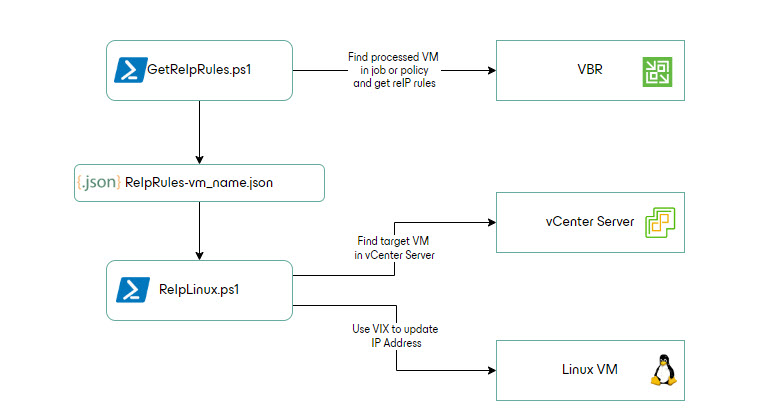
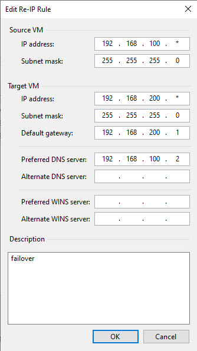

# Veeam Recovery Orchestrator - Re-IP Linux VMs using PowerCLI and Network Manager (nmcli)

## Author

Tyson Fewins (tfewins)
Razvan Ionescu 

## Function

This script is designed to query and modify the network device settings in a Linux VM that uses Network Manager to control device configurations. This script is used as a VM step in a recovery or replication failover plan.

***NOTE:*** Before executing this script in a production environment, I strongly recommend you:

* Read the Veeam Recovery Orchestrator User Guide
* Fully understand what the script is doing
* Test the script in a lab environment
* Understand how Veeam Restore and/or Replica Failover works

## Known Issues

-"Applying re-IP rules" during Process Replica VM step generates a warning. This is normal behavior, as re-IP rules 
  cannot be automatically applied on Linux VMs by VBR.  

## Requirements

* Veeam Backup & Replication v12 or later
* Veeam Recovery Orchestrator v7 or later
* Install VMware PowerCLI on the Veeam Backup & Replication server
  * For PowerCLI install:
    Documentation:
	  https://developer.broadcom.com/powercli/installation-guide
* Network Manager installation is required in the VM Guest OS
  * New releases of RHEL and its derivatives ship with Network Manager, as well as new releases of Ubuntu.
  * Network Manager is available on other Linux OSes but may require installation and configuration
* Credentials for target vCenter and VM need to exist in the Recovery Orchestrator Credentials store
* Add Re IP rule in the replication job or CDP policy used to protect the VMs 

## Description

There are 2 scripts:  

**GetReIpRules.ps1** connects to VBR server and searches the replication job or CDP policy that protects the currently processed VM. 
Once it finds the VM in a job, it reads the re-IP rules from that job and extracts them to a json file.

**ReIpLinux.ps1** reads the json file for the currently proccesed VM and it connects to the VM replica guest OS to change the IP address. 



The scripts are using re-IP rules from VBR replication job or CDP policy to extract network information. 

For example:  
  

Make sure to enter only the keyword "failover" in description. The script uses the description keywords to identify which re IP rule to extract.  

When using CDP policies, you need to run re-IP during failback. For this, create a second rule in the CDP policy, fill in the required parameters and add in description the keyword "failback".


## Additional Information

In the Orchestration plan - Plan Steps

* Modify the following pre-defined parameter values
```
    Common Parameters/Retries = 1 (to limit execution time in case of failure)
    Execute Location/Default Values = Veeam Backup Server
```
* **GetReIpRules.ps1** Add the following required Step Parameters:
```
    Name = VbrCredentials
    Desription = The credential used to authenticate to the Veeam Backup Server where the script is executed
    Type = Credential
    Default Value = (Set a default value as needed)

    Name = SourceVmName
    Desription = Protected VM name
    Type = Text
    Default Value = %source_vm_name% (this will pass the VM name at runtime)

    Name = LogPath
    Desription = Local path on "VbrHostname" where to create logs
    Type = Text
    Default Value = (Set a default value as needed)

    Name = CurrentPlanState
    Desription = VRO plan state
    Type = Text
    Default Value = %plan_state% (this will pass the plan state at runtime)

```
* **ReIPLinux.ps1** Add the following required Step Parameters
```
    Name = vCenterServer
    Desription = Hostname, FQDN, or IP of the vCenter Server that manages the target VM. This is used for PowerCLI connection.
    Type = Text
    Default Value = (Set a default value as needed)

    Name = vCenterServerCreds
    Desription = The credential used to authenticate to the "vCenterServer"
    Type = Credential
    Default Value = (Set a default value as needed)

    Name = GuestOsCreds
    Desription = The credential used to authenticate in the VM guest OS
    Type = Credential
    Default Value = (Set a default value as needed)

    Name = SourceVmName
    Desription = Protected VM name
    Type = Text
    Default Value = %source_vm_name% (this will pass the VM name at runtime)

    Name = VMName
    Desription = Name of the target VM
    Type = Text
    Default Value = %target_vm_name% (this will pass the VM name at runtime)

    Name = VMOrigIP
    Desription = Original IP Address. Used to locate the network device to be modified. 
    Type = Text
    Default Value = %current_vm_ip% (this will pass the VM IP at runtime)

    Name = LogPath
    Desription = Local path on "VbrHostname" where to create logs
    Type = Text
    Default Value = (Set a default value as needed)
 
```
* **ReIPLinux.ps1** Add the following optional Step Parameters if needed
```
    Name = SudoRequired
    Desription = Use this parameter to force the use of Sudo. 
    Type = Text
    Default Value = true (the script defaults to false unless this parameter is set to 'true')

    Name = SudoPassRequired
    Desription = Use this parameter to specify if a password is not required. The script defaults to using a password with Sudo if 'SudoRequired' is set to true. 
    Type = Text
    Default Value = false (the script defaults to true unless this parameter is set to 'false')
```
* The script is set to work for VMware VMs that have a 'Guest OS Family' of 'Linux' and a 'Guest OS Version' of "*CentOS*", "*Red Hat*", or "*Ubuntu*". If you have configured a VM with another OS Version such as "*Debian*" to use Network Manager to configure network devices, the script can be modified to enable exection for this OS Type in the "SetVMNetworkInterface" function where the OS Type is checked.
